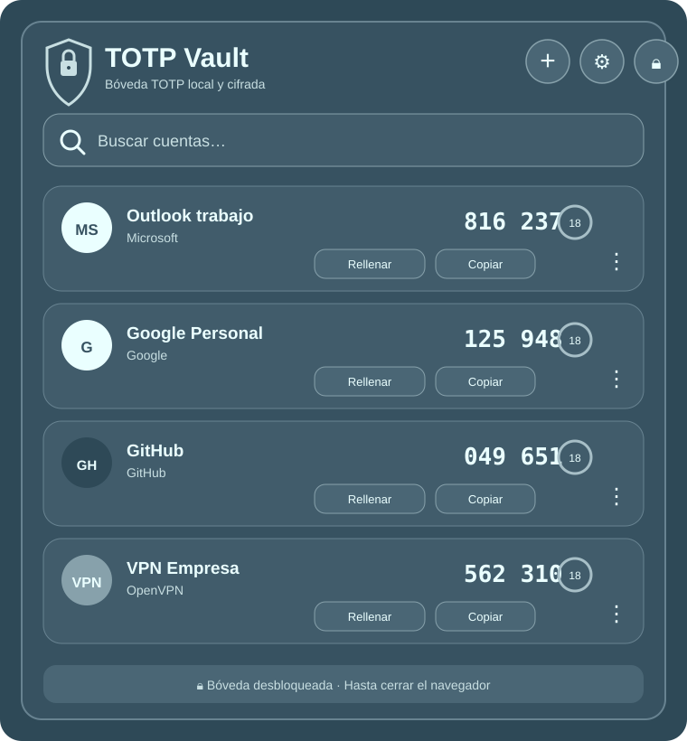
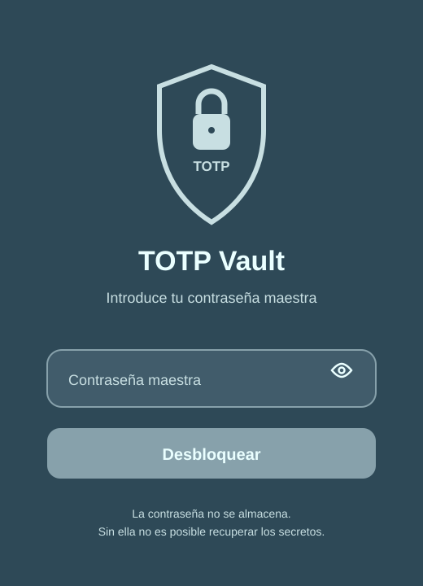

# TOTP Vault

Extensión Chrome Manifest V3 para almacenar y utilizar múltiples códigos TOTP de forma local y cifrada.

## Capturas

### Bóveda

### Desbloqueo con contraseña maestra

  

## Características

- Múltiples códigos TOTP con nombre, descripción e icono.
- Secretos Base32 y URI `otpauth://totp/...`.
- SHA-1, SHA-256 y SHA-512.
- 6 u 8 dígitos.
- Botón **Copiar** y botón **Rellenar**.
- Autorrelleno de campos OTP, grupos de 6/8 casillas, inputs `password`, Shadow DOM abierto y frames accesibles.
- Iconos integrados para servicios habituales y posibilidad de usar iconos personalizados.
- Búsqueda de cuentas.
- Contraseña maestra.
- Cifrado local de la bóveda con **AES-256-GCM**.
- Derivación de clave con **PBKDF2-HMAC-SHA-256 (310.000 iteraciones)**.
- Bloqueo automático configurable o hasta cerrar el navegador.
- Exportación e importación de copia de seguridad cifrada.

## Seguridad

- La contraseña maestra **no se almacena**.
- La clave de sesión se mantiene únicamente en `chrome.storage.session`.
- `chrome.storage.local` y `chrome.storage.session` están restringidos a `TRUSTED_CONTEXTS`.
- El selector manual de campo OTP exige un clic real del usuario mediante `event.isTrusted`.
- Se usan `activeTab` + `scripting`; no se solicita `<all_urls>` ni acceso permanente al historial de navegación.
- Los secretos persistentes se almacenan cifrados localmente.

Consulta también [`SECURITY.md`](SECURITY.md) para más detalles.

## Instalación

1. Descarga o clona el repositorio.
2. Abre `chrome://extensions`.
3. Activa **Modo de desarrollador**.
4. Pulsa **Cargar descomprimida**.
5. Selecciona la carpeta que contiene `manifest.json`.

## Iconos

TOTP Vault puede detectar automáticamente servicios habituales como Outlook/Microsoft 365, Microsoft, Google, GitHub, AWS, Azure, Cloudflare, Apple/iCloud, Meta, Dropbox o VPN.

También puedes seleccionar un icono manualmente o subir un PNG/JPG/WebP personalizado. Los iconos personalizados se rasterizan y se guardan dentro de la bóveda cifrada.

## Permisos

- `storage`: bóveda cifrada persistente y sesión temporal.
- `activeTab`: acceso temporal a la pestaña activa cuando utilizas el autorrelleno.
- `scripting`: inyección puntual del código de autorrelleno.
- `clipboardWrite`: copiar códigos TOTP.

## Limitaciones del autorrelleno

Chrome no permite inyectar código en algunas páginas internas, iframes especialmente restringidos o campos encapsulados en Shadow DOM cerrado. En esos casos siempre puedes utilizar **Copiar**.

## Historial reciente

### v2.7.x

- Sistema de iconos automáticos, manuales y personalizados.
- Nueva gama cromática azul-gris.
- Interfaz más plana, sin sombras ni glow innecesario.
- Revisión del icono principal de la extensión.

### v2.6.0

- Pulido general de interfaz.
- Header, buscador, tarjetas y menús refinados.
- Botones con SVG consistentes.

### v2.5.0 — Hardening

- `TRUSTED_CONTEXTS` para almacenamiento local y de sesión.
- `event.isTrusted` en el selector manual de campo OTP.
- Sin restricciones por dominio y sin borrado automático del portapapeles.

## Recuperación

La contraseña maestra no se guarda. Si la olvidas y no conservas una copia de seguridad o los secretos originales, no existe un mecanismo de recuperación.

La copia exportada contiene la bóveda cifrada; para abrirla tras importarla necesitarás la contraseña maestra con la que fue cifrada.
